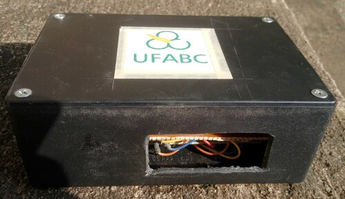

<!---
title: Projeto plataforma strapdown
layout: post
category: Projetos
--->
Obter a atitude de drones, veículos subaquáticos e outros dispositivos com 6 graus de liberdade é uma das tarefas mais desafiadoras no projeto de sistemas de controle de navegação. Por este motivo, muitos projetos utilizam programas proprietários ou limitam-se á simulações. Neste trabalho é apresentado um sistema completo para determinação de atitude capaz de fornecer medidas calibradas e atitude estimada utilizando sensores MEMS, com microcontrolador de baixo custo e baixo consumo energético. Acelerômetro e magnetômetro são calibrados online no sistema embarcado como emprego do método dos mínimos quadrados sem auxílio de equipamentos externos. O estado estimado é computado com um rápido algorítimo algébrico de quatérnios consumindo menos de 1,5ms com emprego de um filtro aditivo de Kalman linear.

# Trabalho de graduação
Estas bibliotecas são resultados do Trabalho de Graduação de Engenharia Aeroespacial
  - <https://github.com/roneydua/plataformaStrapdown/blob/master/pdfFiles/TG.pdf>
    
Artigo publico no Congresso Brasileiro de Automática no ano 2020.
  - <https://www.sba.org.br/open_journal_systems/index.php/sba/article/view/1155/1082>

# Instação
Para instar esses bibliotecas basta executar o comando:

    git clone https://github.com/roneydua/plataformastrapdown.git

Repositório disponível em: https://github.com/roneydua/plataformastrapdown.git

# Foco do programa:
O foco destas bibliotecas é de contrução para uma plataforma strapdown de seis graus de liberdade tal que forneça:
- Dados de giroscopio, acelerometro e magnetometro da MPU9250 calibrados. Sendo que:
  - Os giroscopios são calibrados com a eliminação do erro sistemático com a função  `(IMU::calibraGyro())`; que atualiza a variável `_biasGyro` que é um vetor 3x1.
  - O magnetometro é calibrado pelo método geométrico com a função `int calibracaoGeometrica(MatrixXf &data, Matrix3f &sF, Vector3f &bias, float moduloCampo)`.

    Para utilizar este método é necessário coletar medidas rotacionando a plataforma. Durante a rotação estas medidas coletadas são armazenadas em uma matriz Nx3 `&dados`. Quando mais dados coletados, mais acurada costuma ser a calibração (500 medidas costumam apresentar bons resultados). `&sF` é um matriz 3x3 diagonal com os fatores de escala e `&bias` é um vetor 3x1 de bias. Quando o método falha, retorna um número negativo.
  - O acelerometro é calibrado com a função `int calibracaoAcelerometro(MatrixXf &X, MatrixXf data)`
    A base desenvolvida possui o sensor preso como pode ser visto na figura abaixo:

      

    Depois de montada e fechada, o algoritmo de calibração do acelerometro precisa da tomada de dados nas seis orientações para resolver o problema de minimos quadrados. A base fechada como mostra a figura possibilita que essa tomada seja feita de forma simples.

      

- The quaternion attitude and Euler's angles of body.

# Funcionalidade
O projeto fornece um vetor de dimensão 4+3+3+3+3+1 = 17 floats. Na seguinte sequência:

| Quaternions components | Euler's angles | Accelerometer | Magnetometer | Gyroscope | Elapsed time |
|------------------------|----------------|---------------|--------------|-----------|--------------|
| normalized             | degrees        | m/s           | normalized   | rad/s     | seconds      |

## Divisão das tarefas
O ESP-32 possui dois núcleo como capacidade de realizar operações multitarefa. Um dos núcleos executa a função `void estimadorCodigo(void *)` e  o outro a função `void comunicacaoCodigo(void *)`.

# Métodos de calibração
The sensors are calibrated with:
- giroscopios
  - Only remove the systematic errors
- Acelerômetros
  - Kuncar, A., Sysel, M., & Urbanek, T. (2016). Calibration of triaxial
    accelerometer and triaxial magnetometer for tilt compensated
    electronic compass., 45–52. http://dx.doi.org/10.1007/978-3-319-33389-2_5
- Magnetômetros
  - STMicroelectronics, (2010). Using LSM303DLH for a tilt
    compensated electronic compass.

# Estimador de atitude
A estimação da atitude é feita com um filtro de Kalman linear e Quatérnios são utilizados para representar a atitude.

# Depedencias
Este projeto utiliza a biblioteca EIGEN

<!-- # Sobre este projeto -->
